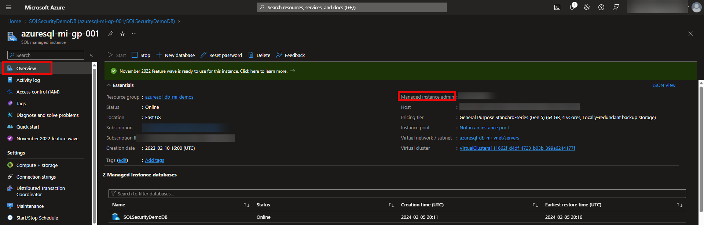

# SQL-Least-Privilege-Access-Control

This is a solution to implement SQL Server security, by removing rights of DBAs to SELECT data from tables.<be>

The implementation is structured having the following principles:

- 1st: Identification of columns with PII or PHI data that need to be masked

  - masking these columns
  - Setting these columns to be audited with DATA CLASSIFICATION access
  - Set SQL Server Auditing on the instance
  - Set SQL Server Database auditing for the database containing that data

- 2nd: Identify common Database Admin tasks and define privileges needed for those tasks. The solution developed with this repo considers the following possibilities:
  - BREAK GLASS. Where the DBA requires a system admin account to perform the job. This includes but is not limited to:
    - Configure AlwaysON Availability Group
    - Setup Replication
    - Setting Resource Governor
  - Access Control. Activities that can be performed by a DBA that require permissions that can be granted using
    - Server Roles
    - Database Roles
    - Custom Roles
  - Wrapper Code. Activities that can be performed by executing Stored Procedure code developed for single purpose, like:
    - running DBCC commands
    - setting or changing QUERY STORE properties
  

  This solution prioritized finding Access Control options, as these are easy to implement and backward compatible with future SQL Server versions

  It is recommended to work first with the contents on the AUDITING folder, and then use the contents on the other folders as needed

  **NOTE**: the database used is a copy of the AdventureWorks sample database 
  You can download a copy of the AdventureWorks database from [here](https://github.com/Microsoft/sql-server-samples/releases/download/adventureworks/AdventureWorks2019.bak) 
  The examples are based on the [AdventureWorks2019](https://github.com/Microsoft/sql-server-samples/releases/download/adventureworks/AdventureWorks2019.bak) version - but any version should work with minimal adjustments 

## NOTES: 

### 1-  All scripts display the **login name** to be used for that script at the very top. 

<ul>
<li>Execute the Query to display the username to make sure you are using the correct persona</li>
<li>For scripts that switch between MASTER and the SQLSecurityDemoDB databases:<ul>
  <li>After Switching the database, execute the query to display the username again, so you can see how that user is mapped</li>
  <li>When testing these scripts on Azure SQL Database the **USE** command will fail, you need to switch the database manually via SSMS toolbar</li>
  </ul>
</ul>
 

### 2 - for Azure SQL Managed Instance. 
For scripts using **sa** principal for SQL Server instance running on-premises or on a VM: 
When testing the scripts on an Azure SQL Managed Instance, instead of **sa** you need to login with the **Managed Instance Admin** that can be obtained at the Overview page of your Azure SQL MI

## disclaimer

  This Sample Code is provided for illustration only and is not intended to be used in a production environment. 
  THIS SAMPLE CODE AND ANY RELATED INFORMATION ARE PROVIDED "AS IS" WITHOUT WARRANTY OF ANY KIND, EITHER EXPRESSED OR IMPLIED, INCLUDING BUT
  NOT LIMITED TO THE IMPLIED WARRANTIES OF MERCHANTABILITY AND/OR FITNESS FOR A PARTICULAR 
  PURPOSE.  We grant You a nonexclusive, royalty-free right to use and modify the Sample Code
  and to reproduce and distribute the object code form of the Sample Code, provided that You
  agree:  
    (i) to not use Our name, logo, or trademarks to market Your software product in which the Sample Code is embedded; 
    (ii) to include a valid copyright notice on Your software product in which the Sample is embedded; 
    and (iii) to indemnify, hold harmless, and defend Us and Our suppliers from and against any claims or lawsuits, including attorneys fees, that arise or result from the use or distribution of the Sample Code.  

## References

The following links are useful resources for your study / SQL security review.
- [Workpshop: SQL Security Ground to Cloud](https://github.com/David-Seis/SecureYourAzureData) by Buck Woody and David Seis 
- [Packaging Permissions in Stored Procedures](https://www.sommarskog.se/grantperm.html) by Erland Sommarskog, SQL Server MVP - updated on 2023-06-13. 
- [Using Query Store with least privileges instead of db_owner to achieve Separation of Duties](https://techcommunity.microsoft.com/t5/azure-sql-blog/using-query-store-with-least-privileges-instead-of-db-owner-to/ba-p/775177) by Andreas Wolter 
- [New granular permissions for SQL Server 2022 and Azure SQL to improve adherence with PoLP](https://techcommunity.microsoft.com/t5/sql-server-blog/new-granular-permissions-for-sql-server-2022-and-azure-sql-to/ba-p/3607507) by Andreas Wolter 
  
  
